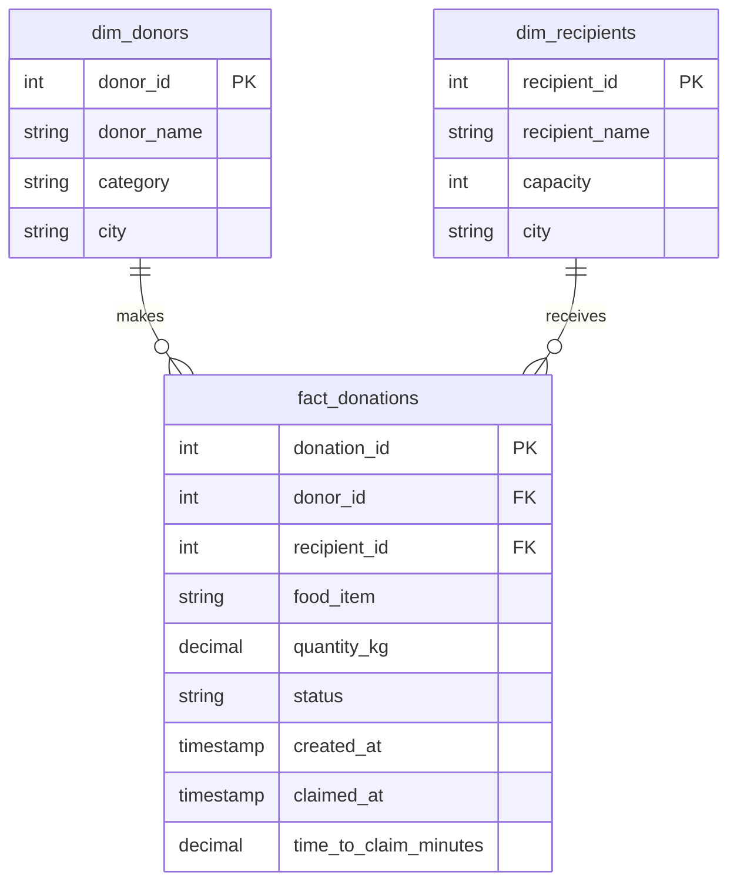

# MealBridge Data Warehouse ER Diagram (Star Schema)

```mermaid
erDiagram
    dim_donors {
        int donor_id PK
        string donor_name
        string category
        string city
    }
    dim_recipients {
        int recipient_id PK
        string recipient_name
        int capacity
        string city
    }
    fact_donations {
        int donation_id PK
        int donor_id FK
        int recipient_id FK
        string food_item
        decimal quantity_kg
        string status
        timestamp created_at
        timestamp claimed_at
        decimal time_to_claim_minutes
    }
    dim_donors ||--o{ fact_donations : "makes"
    dim_recipients ||--o{ fact_donations : "receives"
```
